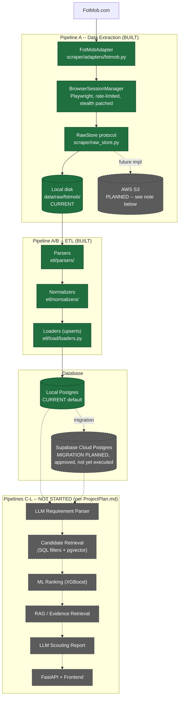

# Architecture & Project Status

This is the living status document for the project: high-level architecture (HLD), what's built vs. planned, and a master todo list for tracking. For the file-level/code architecture (LLD — which files talk to which), see [`docs/LLD.md`](docs/LLD.md).

`ProjectPlan.md` is the original full-platform vision (LLM parsing, ML ranking, RAG, scouting reports). This document tracks actual implementation progress against that vision, kept current after every commit (see `CLAUDE.md`).

## High-Level Design (HLD)



**Solid boxes/arrows = built and verified. Dashed boxes/arrows = planned, not implemented.**

### Clarifying the "future S3" point

Raw scraped data (full FotMob HTML/JSON pages) is currently written to local disk under `data/raw/fotmob/{entity_type}/{id}/{timestamp}.{html,json}` via `scraper/raw_store.py::LocalFileRawStore`. This already implements a small `RawStore` **protocol** (`write()`/`read()`), specifically so a future `S3RawStore` implementing the same protocol is a **near drop-in swap** — no scraper/ETL logic needs to change, only which `RawStore` implementation `scraper/cli.py` constructs.

Why this matters going forward: coverage is currently **one competition, one season** (Premier League 2025-2026 — see `config/coverage.yaml`, where La Liga/Brasileirao are configured but marked `active: false`). As coverage expands to more competitions/seasons, the raw HTML/JSON volume multiplies (today's single season already uses ~900MB locally). S3 is the natural target once that scale stops being comfortable on a laptop disk — not needed yet, but the storage layer is already designed so that switch doesn't require a rewrite.

**This is not yet built.** No `S3RawStore` code exists. It's a placeholder in the architecture, not a task in progress.

### Current data flow, in one sentence per stage

1. **Scrape** (`scraper/`): Playwright drives a real headless Chromium browser to FotMob's pages, extracting embedded JSON, rate-limited and retried, writing raw artifacts to disk.
2. **ETL** (`etl/`): reads only those raw files (never the network), parses FotMob's JSON shapes into typed models, normalizes into the canonical schema, and upserts into Postgres.
3. **Store** (`db/`): SQLAlchemy models + Alembic migrations; currently local Postgres, Supabase migration planned (see todo list).
4. **Everything past this point** (requirement parsing, ranking, RAG, reports, API) — **not started**. This document's todo list is explicit about that so nobody mistakes the current tool for a finished platform.

---

## Master Todo List

Legend: `[x]` done and verified · `[~]` in progress / partially done · `[ ]` not started

```
scout_it/
├── Pipeline A -- Data Extraction                                    [MOSTLY DONE]
│   ├── [x] Source Adapter interface (scraper/base.py)
│   ├── [x] FotMob adapter (scraper/adapters/fotmob.py)
│   │   ├── [x] Competition/club/squad discovery (live-verified: exactly 20 EPL clubs, no false positives)
│   │   ├── [x] Player profile fetch
│   │   └── [x] Player season-stats fetch (fixed: was duplicating the profile fetch; now resolves
│   │            the FotMob entryId and hits the real per-season/per-90/percentile endpoint)
│   ├── [x] Browser session mgmt, rate limiting, retry/backoff, stealth patches
│   ├── [x] Sofascore adapter -- built, then REMOVED (decision: FotMob is sole source of truth)
│   ├── [x] Raw file storage (scraper/raw_store.py) -- local disk only
│   │   └── [ ] S3RawStore implementation (protocol already supports this -- see HLD note)
│   ├── [x] Coverage config (config/coverage.yaml) -- EPL 2025-2026 active
│   │   └── [ ] Additional competitions/seasons (La Liga, Brasileirao configured but inactive)
│   ├── [x] Full EPL crawl completed: 20 clubs, 572 players, profiles + season stats
│   └── [ ] scraper doctor / canary check before full runs (mentioned in etl/PLAN.md risks, not built)
│
├── Pipeline B -- Normalization & Feature Engineering                [PARTIALLY DONE]
│   ├── [x] Raw models (etl/models_raw/fotmob.py)
│   ├── [x] Parsers (etl/parsers/fotmob_parser.py) -- zero parse errors across all 572 players
│   ├── [x] Normalizers (etl/normalizers/club.py, player.py, player_stats.py)
│   ├── [x] Loaders / upserts (etl/load/loaders.py) -- single-source entity resolution (seed, no
│   │        fuzzy matching needed since Sofascore removal)
│   ├── [x] etl/cli.py -- full run validated: 420/572 players with season stats (rest have no
│   │        registered minutes this season -- legitimate gap, not a bug), zero parse errors
│   ├── [ ] Per-90/percentile feature engineering beyond what FotMob already provides (age
│   │        adjustment, competition-strength adjustment, performance trend per ProjectPlan.md sec. 5)
│   ├── [ ] PlayerClubHistory / PlayerCompetitionHistory population (schema exists, unused --
│   │        club linkage today only exists implicitly via PlayerStats.club_id)
│   └── [ ] Fixture-based unit tests for parsers/normalizers (tests/unit/ is still empty stubs)
│
├── Database & Infra                                                 [IN PROGRESS]
│   ├── [x] Local Postgres schema + 3 Alembic migrations
│   ├── [x] db/session.py hardened for remote/pooled connections (pool_pre_ping, pool_recycle,
│   │        connect_timeout -- added ahead of the cloud migration)
│   ├── [x] config/settings.py: dual DB target support (SCOUT_IT_DATABASE_URL +
│   │        SCOUT_IT_SUPABASE_DATABASE_URL) for tooling that needs to address either explicitly
│   ├── [~] Supabase cloud migration -- PLAN APPROVED, execution blocked on a manual step:
│   │   ├── [ ] Create Supabase project via dashboard (requires account, cannot be automated)
│   │   ├── [ ] Run `alembic upgrade head` against the new cloud DB
│   │   ├── [ ] Data migration: pg_dump/pg_restore existing local data (20 clubs, 572 players,
│   │   │        420 stats rows, ~33k market values, ~556 attribute profiles)
│   │   ├── [ ] Sequence reset post-restore (required -- see Supabase section of ARCHITECTURE
│   │   │        history / etl notes, otherwise next INSERT collides with an existing PK)
│   │   └── [ ] Verification: alembic current, row-count parity, app-level spot check
│   ├── [x] scripts/data_visualizer.py -- tabular DB report (row counts, completeness %, top
│   │        scorers, market value leaders, scrape ledger summary), supports --target local|supabase,
│   │        run successfully against local
│   └── [ ] AWS S3 raw storage backend (see HLD note -- placeholder only, no code)
│
├── Pipelines C-L -- Requirement Parsing, Retrieval, Ranking, RAG,   [NOT STARTED]
│   Reports, Evaluation, Fine-tuning, Human Feedback (ProjectPlan.md sections 6-16)
│   └── [ ] No code exists for any of these yet. All still at the design/vision stage in
│            ProjectPlan.md. This is most of the actual "scouting platform" -- what's built so
│            far is exclusively the data foundation it will eventually sit on.
│
└── Documentation & Process
    ├── [x] ProjectPlan.md -- original full-platform vision
    ├── [x] README.md -- Pipeline A tool setup/usage
    ├── [x] etl/PLAN.md -- ETL design + checklist
    ├── [x] ARCHITECTURE.md -- this document (HLD + master todo list)
    ├── [x] docs/LLD.md -- file-level/code architecture diagram
    └── [x] CLAUDE.md -- project instructions, including "update ARCHITECTURE.md after every commit"
```

### Known small debts (not urgent, tracked so they aren't forgotten)

- `failed_fetch` table is append-only and accumulates duplicate historical failure rows across repeated crawl attempts on the same players -- fine for now, would want a cleanup/dedup pass if it becomes hard to read.
- `_fetch_with_freshness`'s `FailedFetch.url` field is always empty (exceptions don't carry a `.url` attribute) -- harmless (the URL is in the `error` text) but cosmetically wrong.
- `Club` identity is keyed by name only (no `source_club_id` mapping table like `Player` has) -- fine for a single source/competition, would need revisiting if a name collision risk emerges (e.g. two same-named clubs across countries).
