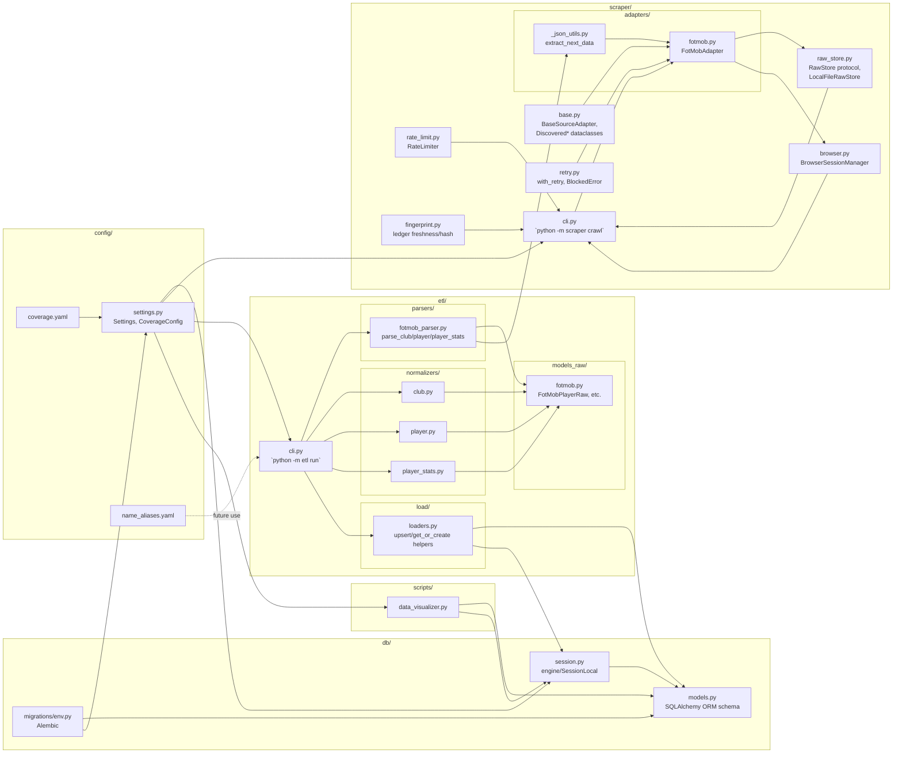

# Low-Level Design — File/Code Architecture

Companion to [`../ARCHITECTURE.md`](../ARCHITECTURE.md) (which has the high-level picture and the master todo list). This document maps how the actual files in the repo depend on and call into each other. Update it whenever a module's responsibilities or dependencies change materially (new adapter, new pipeline stage, restructured imports) — not for every commit.

## Module dependency graph

## File responsibilities

### `config/`
- **`settings.py`** — `Settings` (pydantic-settings, `SCOUT_IT_` env prefix, `.env`-driven): `database_url`, `supabase_database_url`, rate-limit/concurrency per source, entity-resolution thresholds. `CoverageConfig`/`CompetitionCoverage`/`SeasonCoverage`: typed parse of `coverage.yaml`.
- **`coverage.yaml`** — which competitions/seasons to crawl, per-source competition/season IDs. Single source of truth for scope (currently EPL 2025-2026 only active).
- **`name_aliases.yaml`** — manual player-name overrides for entity resolution; currently unused (dormant since Sofascore removal, no cross-source matching needed).

### `scraper/`
- **`base.py`** — `BaseSourceAdapter` ABC (the interface every source adapter implements), `Discovered*` dataclasses (`DiscoveredCompetition/Season/Club/Player`), `RawFetchResult`, and `competitions_from_coverage`/`seasons_from_coverage` helpers (config-driven discovery, not live site crawling — see `ARCHITECTURE.md`).
- **`browser.py`** — `BrowserSessionManager`: one Playwright browser per process, one `BrowserContext` per source per run (reused, not per-request), concurrency semaphores, stealth patches, context recycling.
- **`rate_limit.py`** — `RateLimiter`: politeness delay before every navigation.
- **`retry.py`** — `with_retry` decorator (exponential backoff), `BlockedError`/`FetchError`, `looks_blocked` (block-page heuristic).
- **`raw_store.py`** — `RawStore` protocol (`write`/`read`) + `LocalFileRawStore` implementation. This is the extension point for a future `S3RawStore`.
- **`fingerprint.py`** — `scrape_ledger` read/write helpers: `is_fresh` (skip-if-recently-fetched), `record_fetch` (upsert ledger row + content-hash comparison).
- **`cli.py`** — `python -m scraper crawl --source fotmob --competition epl --season ... --stage ...`. Orchestrates discover→fetch, freshness-gated via `fingerprint.py`, failures logged to `FailedFetch` via `db.models`.
- **`adapters/fotmob.py`** — `FotMobAdapter`: implements `BaseSourceAdapter` against FotMob specifically. HTML+`__NEXT_DATA__` extraction for competition/club/player pages; a separate JSON endpoint (`/api/data/playerStats`) for season stats, keyed by an `entryId` resolved from the player's own profile page.
- **`adapters/_json_utils.py`** — `extract_next_data` (pulls the Next.js SSR JSON blob out of raw HTML), `find_dicts_with_keys` (duck-typed recursive search, used sparingly — precise paths are preferred where known, see `fotmob.py`'s squad-group lookup).

### `etl/`
- **`cli.py`** — `python -m etl run --competition epl --season 2025-2026`. Reads only `data/raw/fotmob/` on disk (never the network); for each club directory found, parses the club + its squad, then for each player parses profile + stats (if present) and loads everything via `etl/load/loaders.py`.
- **`models_raw/fotmob.py`** — loosely-typed Pydantic models mirroring FotMob's raw JSON shapes (`FotMobClubRaw`, `FotMobPlayerRaw`, `FotMobPlayerStatsRaw`, plus `RawInfoItem`/`StatItem`).
- **`parsers/fotmob_parser.py`** — raw HTML/JSON → the above raw models. Knows FotMob's exact nesting (e.g. club pages nest under `fallback["team-{id}"]`, player pages are flat; season stats merge two sub-sections, `statsSection` + `topStatCard`, since neither alone has everything).
- **`normalizers/club.py` / `player.py` / `player_stats.py`** — raw models → plain dicts of canonical field values (nationality code→name resolution, position/foot extraction, market-value/attribute-profile shaping, stat promotion to named columns vs. JSONB catch-all).
- **`load/loaders.py`** — DB-aware find-or-create/upsert helpers (`Country`, `Competition`, `Season`, `Club`, `Player` via `player_source_mapping`, `PlayerStats`, `PlayerMarketValue`, `PlayerAttributeProfile`). Deliberately keeps reference-data resolution (country code → name, club name lookup) here rather than in normalizers, since it needs the DB session.
- **`entity_resolution/`, `models_raw/__init__.py`, etc.** — package scaffolding; entity resolution logic is dormant (single-source, no fuzzy matching needed — see `ARCHITECTURE.md`).

### `db/`
- **`models.py`** — SQLAlchemy ORM schema: `Country, Competition, Season, Club, Player, PlayerSourceMapping, PlayerStats, PlayerMarketValue, PlayerAttributeProfile, PlayerClubHistory, PlayerCompetitionHistory, ScrapeLedger, EntityResolutionReview, FailedFetch`.
- **`session.py`** — `create_engine`/`SessionLocal` singleton bound to `settings.database_url` at import time (hardened with `pool_pre_ping`/`pool_recycle`/`connect_timeout` for remote/pooled DB resilience).
- **`migrations/env.py`** + **`migrations/versions/*`** — Alembic, dynamically pulls `settings.database_url` at runtime (not hardcoded), so it follows whatever the env var currently points at.

### `scripts/`
- **`data_visualizer.py`** — standalone tabular DB report (row counts, player-data completeness %, top scorers, market-value leaders, scrape-ledger summary). Builds its own engine per `--target local|supabase` rather than reusing `db/session.py`'s fixed singleton, since the whole point is to be able to address either DB explicitly regardless of the primary `SCOUT_IT_DATABASE_URL`.

### Not yet built (see `ARCHITECTURE.md` for the full list)
- `scraper/adapters/` — no `S3RawStore`, no second source adapter (Sofascore was removed).
- `etl/` — no fixture-based unit tests yet (`tests/unit/` is empty stubs); `PlayerClubHistory`/`PlayerCompetitionHistory` tables exist but nothing writes to them.
- Everything past the database layer (requirement parsing, ranking, RAG, reports, API, frontend) — zero code, design-stage only in `ProjectPlan.md`.
